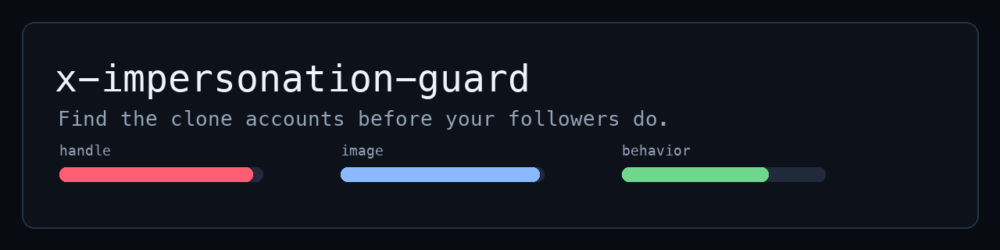
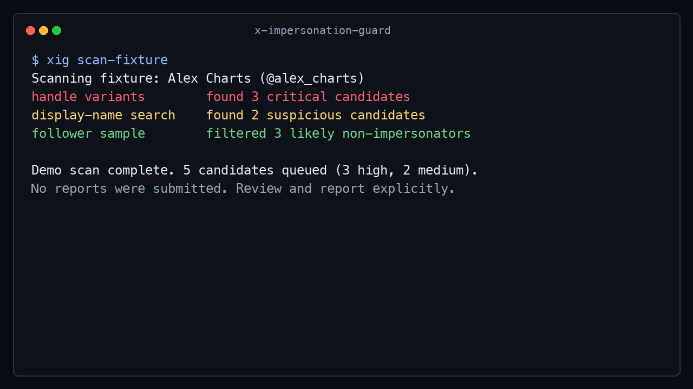
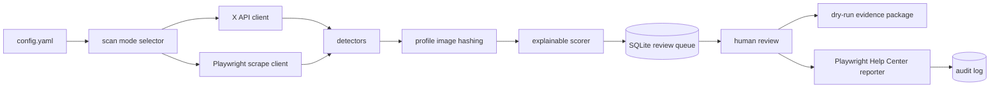
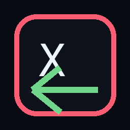

<meta property="og:image" content="https://raw.githubusercontent.com/wheelieinvestor/x-impersonation-guard/main/docs/assets/og-image.png">
<meta property="og:title" content="x-impersonation-guard">
<meta property="og:description" content="Detect and report X accounts impersonating you. Local-first, explainable, safe by default.">





# x-impersonation-guard

> Detect and report X accounts impersonating you. Local-first, explainable, safe by default.

[](https://github.com/wheelieinvestor/x-impersonation-guard/actions)
[](https://pypi.org/project/x-impersonation-guard/)
[](LICENSE)
[](https://www.python.org/downloads/)

**Status: Public alpha.** Offline demo, dry-run reporting, fail-closed reporter safety, first-run config generation, dependency security posture, and three-environment PyPI install are verified. Live X API scans and live help.x.com submissions are implemented but still pending controlled live validation. See [docs/status.md](docs/status.md).

---

**The problem:** Public figures and creators on X get cloned constantly. Impersonators farm followers, run crypto scams, and damage reputations. The official reporting flow is manual, slow, and limited.

**What this does:** Detects impersonators of your account using multi-signal scoring: handle similarity, display-name match, profile-picture perceptual hashing, posting behavior, account age, follower patterns, and verification status. It surfaces candidates in a review queue with explainable scores and files official reports through X's Help Center via Playwright when you approve them.

**What this is not:** A way to silence critics or parody accounts. A bypass of X's limits. A guarantee of removal. Legal advice. See [What this tool does NOT do](#what-this-tool-does-not-do).

---

## Try it in 60 seconds

No credentials. No live X calls. No reports submitted.

```bash
pip install --pre x-impersonation-guard
playwright install chromium
xig scan-fixture
xig doctor
xig review
```

The bundled demo uses a fictional finance creator, `@alex_charts`, and eight realistic fake candidates: obvious scam clones, suspicious gray-area accounts, a fan account, an older unrelated account, and a random follower. The point is judgment, not just detection.

To create a dry-run evidence package:

```bash
xig list
xig report --dry-run 1
```

Everything runs locally on your machine. Nothing touches the real X in fixture mode.

## Why this exists

Most existing options leave you stuck:

| Approach | Reality |
|----------|---------|
| Manual reporting through X's UI | Repetitive, slow, no local audit trail |
| Hiring a brand-protection service | Expensive, opaque process, not built for small creators |
| "Just ignore them" | Followers get scammed in your name |
| One-off scripts | Usually detect only one signal and stop before the report workflow |

`x-impersonation-guard` automates the full detection-to-report pipeline locally, with an explainable scoring model and a hard safety gate before any live submission.

## What is verified

This repo has been through a launch-readiness cleanup, not just a happy-path demo.

| Evidence | What it proves |
|----------|----------------|
| [PR #1](https://github.com/wheelieinvestor/x-impersonation-guard/pull/1) | Alpha CLI, packaging, scoring, queue, docs, and CI foundation. |
| [PR #2](https://github.com/wheelieinvestor/x-impersonation-guard/pull/2) | Audit response: fail-closed reporter, offline demo, docs alignment, repo polish. |
| [PR #3](https://github.com/wheelieinvestor/x-impersonation-guard/pull/3) | PyPI install validation logs across Linux 3.11, Linux 3.12, and macOS 3.11. |
| [docs/status.md](docs/status.md) | Current verification matrix: what is proven, pending, and intentionally not run yet. |

MIT license, public CI, pinned dependencies, and a dry-run-first reporting path are part of the trust model.

## Use it for real

After the offline demo works, set up against your actual handle.

```bash
# 1. Optional but recommended: get an X API bearer token from https://developer.x.com.
export X_API_BEARER_TOKEN="your_token_here"

# 2. Generate your config.
xig init \
  --handle yourhandle \
  --display-name "Your Name" \
  --reporter-name "Your Legal Name" \
  --reporter-email you@example.com

# 3. Check your local setup before the first real scan.
xig doctor

# 4. Scan. This is read-only. No reports are filed.
xig scan

# 5. Review candidates.
xig review

# 6. Dry-run the first report package before any live submission.
xig report --dry-run 1
```

Prefer prompts? Run `xig init --guided`. If you run `xig init` without identity options, it writes a generic starter config and tells you which fields to edit before live use.

Live browser scanning and live Help Center reporting require `playwright install chromium`. The offline demo and dry-run evidence path do not submit reports.

## How it works



Detection finds candidate accounts through handle variants, display-name search, and follower sampling. Profile image hashes are fetched when image URLs are available. Scoring ranks each candidate from 0 to 100, then stores reviewable accounts in SQLite.

### The scoring model

The default score is a weighted blend of nine signals:

| Signal | Why it matters |
|--------|----------------|
| Handle similarity | Most clones use one-character edits, suffixes, or homoglyphs. |
| Display-name similarity | Clones copy the public-facing name even when the handle changes. |
| Bio similarity | Scam clones often reference the original identity or "official" support. |
| Profile image similarity | Perceptual hashing catches copied profile pictures. |
| Account age | Fresh accounts are more suspicious in impersonation clusters. |
| Follower ratio | Tiny follower counts against a large protected account are a warning sign. |
| Follow-back pattern | Following the protected account's audience is suspicious. |
| Posting behavior | New accounts posting about the protected handle get extra scrutiny. |
| Verified status | Paid verification can make clones more dangerous. |

Parody, fan, satire, "not affiliated", and older-account mitigations reduce scores. That is intentional: the tool should help you report scams, not punish legitimate speech.

### The reporting flow

X does not provide an impersonation-report API. The reporter uses Playwright against X's official Help Center form. By default:

- Reports require explicit review approval before live submission.
- `xig report --dry-run <id>` creates an evidence package without submitting.
- Required Help Center fields fail closed if selectors drift.
- Every report attempt writes an audit package under `~/.x-impersonation-guard/reports/`.

### Local readiness checks

Run `xig doctor` any time setup feels uncertain. It checks Python version, Playwright package availability, Chromium browser installation, config validity, selected scan mode, token presence without printing the token, storage writability, and SQLite queue access. Missing config is treated as setup guidance, not a hard failure, so new users can run it before deciding whether to use the demo or a real account.

## Why I built this

X impersonation is not an abstract platform problem when your followers are the target. A copied profile can look credible enough to move conversations into DMs, push scam links, and make the real account spend time cleaning up confusion instead of building.

The manual reporting path works, but it does not scale well for independent creators. You have to find the account, collect evidence, decide whether it is actually impersonation, fill out forms, and remember what you already reported. That process should be structured, local, auditable, and safe by default.

This project is my attempt to make that workflow practical for people who do not have a brand-protection team. It is open source because the problem is broad, the safety model needs public scrutiny, and useful detection patterns should improve faster than the clone accounts do.

## What this tool does NOT do

- It does not guarantee account removal. X decides enforcement outcomes.
- It does not submit reports through the X API. X has no impersonation report endpoint.
- It does not bypass X rate limits or rotate credentials to evade platform controls.
- It does not fabricate evidence.
- It does not silence critics, parody accounts, fan accounts, or people you dislike.
- It does not provide legal advice.
- It does not provide a hosted SaaS dashboard or browser extension.
- It does not support Threads, Bluesky, Instagram, or multi-platform monitoring yet.

## FAQ

### Will this get my account banned?

Mass reporting can put the reporter account at risk. The tool defaults to review-first mode, `auto_submit: false`, a 5/day reporting cap, and randomized delays. Live submissions require explicit approval unless you deliberately change the config.

### Does this work for brands or companies?

The alpha is optimized for one individual identity. Brand and organization support are on the roadmap after live validation.

### Does X actually remove reported accounts?

At X's discretion. This tool gets reports filed consistently through the official form and keeps an audit trail proving what was submitted.

### Do I need to pay for the X API?

No. Scrape mode can run through Playwright without an API token. API mode is preferred for reliability when you have access.

### Is this against X's ToS?

Detection uses public APIs or public pages. Reporting automates a Help Center form you are entitled to submit. The tool does not bypass limits, fabricate evidence, or rotate credentials.

### Can I run this on a server?

Technically yes, but the defaults are local-first, headed browser, and explicit review approval. Removing guardrails is a config decision and prints warnings.

### What about Threads or Bluesky?

The architecture can support other platforms, but reporters and detectors are platform-specific. Those integrations are later work.

## Roadmap

| Now (v0.2.x alpha) | Soon (v1.0) | Later (v2.0+) |
|--------------------|-------------|---------------|
| Offline demo works | Live X API scan validated | Browser extension |
| Dry-run reporter works | Real impersonator calibration | Threads support |
| Single user identity | First live reports filed | Bluesky support |
| Fail-closed reporter checks | Brand/org identities | Hosted version |
| PyPI prerelease install | Nightly selector drift CI | Multi-platform dashboard |

## Developer install

```bash
git clone https://github.com/wheelieinvestor/x-impersonation-guard.git
cd x-impersonation-guard
uv sync --all-groups
uv run playwright install chromium
uv run pytest
uv run ruff check .
uv run ruff format --check .
uv run mypy src tests
```

## Contributing

See [CONTRIBUTING.md](CONTRIBUTING.md). Good first issues are tracked with the `good first issue` label.

## Security

See [SECURITY.md](SECURITY.md). Do not paste tokens, cookies, browser profiles, or unredacted evidence packages into public issues.

## License

MIT

## Acknowledgements

Built by [Dean Ahrens](https://x.com/WheelieInvestor) at Wheelhouse Capital. Powered by Hermes, a Claude-based coding agent.

## Contributors

<!-- ALL-CONTRIBUTORS-LIST:START -->
| [<br />Dean Ahrens](https://x.com/WheelieInvestor) | [<br />Hermes](https://github.com/wheelieinvestor/x-impersonation-guard) |
| :---: | :---: |
| Ideas, maintenance, project management | Code, docs, tests |
<!-- ALL-CONTRIBUTORS-LIST:END -->
